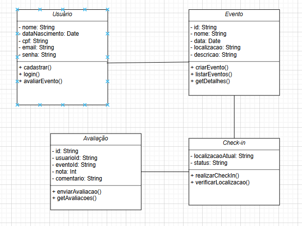
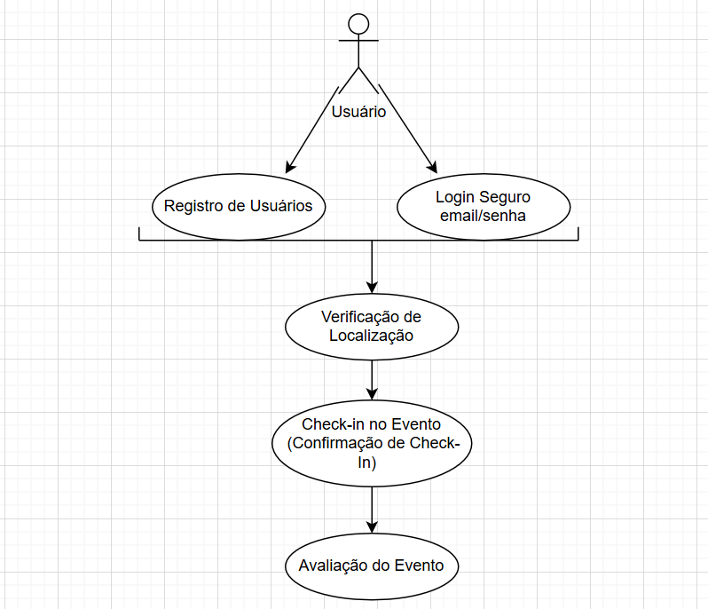
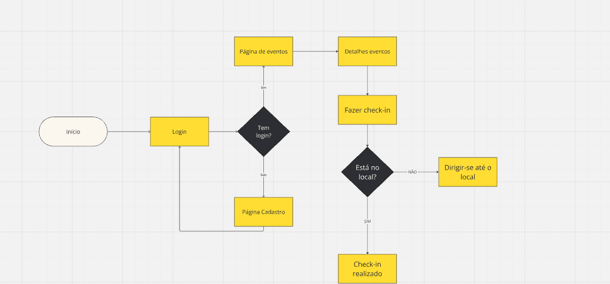

## 📱 Connect Event - App de Check-In em Eventos com Verificação de Localização

### 🎯 **Objetivo do Projeto**
 O Connect Event é um aplicativo inovador projetado para simplificar o check-in digital em eventos, utilizando a geolocalização para garantir a presença dos participantes. Com o Connect Event, os usuários podem confirmar sua entrada de forma rápida e prática, eliminando filas e burocracias. Além disso, ao sair do evento, os participantes têm a oportunidade de avaliar sua experiência, contribuindo para a melhoria contínua dos futuros encontros. A integração com o Firebase garante segurança e eficiência no gerenciamento de dados, tornando cada evento mais interativo e envolvente.

---

### 🛠 **Tecnologias Utilizadas**
   - **Flutter** 🐦: Framework principal para desenvolvimento do aplicativo.
   - **Figma** 🖥️: Para a criação de protótipos.
   - **VS Code** 🖥️: Ambiente de desenvolvimento.
   - **Bluestacks 5** 📱: Emulador Android para testes de interface e funcionalidade.
   - **OpenStreetMaps** 🗺️: Para acessar a localização do evento.
   - **Firebase**🔥: Para acesso ao banco de dados 

---

### 📋 **Funcionalidades Principais**

#### 🔐 Registro e Autenticação
   - **Cadastro de Usuários** 📝: Com opções de cadastro utilizando Nome completo do usuario, Data de Nascimento, CPF, e-mail e senha.
   - **Login Seguro** 🔒: Acesso seguro com autenticação por e-mail/senha.

#### 🌍 Verificação de Localização
   - **Permissões de Localização** 📍: Solicitação de permissão de localização ao usuário.
   - **Geofencing para Check-In** 📏: Ao entrar no raio definido do local do evento, o aplicativo verifica automaticamente se o usuário está apto a fazer o check-in.

#### 🎟️ Check-In no Evento
   - **Confirmação de Check-In** ✅: Usuários podem realizar o check-in ao se aproximarem do local definido.
   - **Avaliação** 📳: Ao sair do raio de localização do evento, abre a tela para a Avaliação.

---

### 🧭 **Arquitetura e Navegação do Aplicativo**

   - **Tela Inicial** 🏠: Exibe os próximos eventos.
   - **Tela de Check-In** 📲: Exibe as informações detalhadas do evento atual, incluindo um botão de check-in que se ativa automaticamente quando o usuário está próximo.
   - **Perfil do Usuário** 👤: Exibe os dados pessoais do usuario.

---

### ⚙️ **Requisitos Técnicos**

#### 🛠  Desenvolvimento 
   -**Flutter** para desenvolvimento da aplicação.

#### 🔌 Back-End e Banco de Dados
   - **Firebase** para autenticação, banco de dados e notificações.

#### 🌐 Geolocalização
   - **API de Localização do OpenStreetMaps** ou equivalente para verificar a posição do usuário em relação ao evento.
   - Geofencing com Flutter usando plugins de localização para integração com o dispositivo.

#### 🧪 Emulação e Testes
   - **Bluestacks 5**: Usado para testar a usabilidade e comportamento da interface.

---

### 🎨 **Design e Experiência do Usuário (UI/UX)**

   - **Intuitividade** 🚀: Simplicidade no acesso às informações de eventos e facilidade de uso no processo de check-in.

  
---

### 🧪 **Testes e Segurança**

   - **Testes de Unidade e de Interface** 🧩: Verificação de todos os componentes e das funcionalidades principais.
   - **Simulação de Localização** 📍: Testes de geofencing para garantir que o check-in só é liberado na área permitida.
   - **Segurança de Dados** 🔒: Autenticação segura, criptografia de dados sensíveis e controle rigoroso de permissões.

---

### ⏱️ **Cronograma do Projeto**

| Fase                       | Descrição                                              | Duração Estimada |
|----------------------------|--------------------------------------------------------|-------------------|
| **Planejamento** 📅        | Definição de requisitos e escopo detalhado             | 1 semana         |
| **Design de Interface** 🎨 | Prototipagem e design das telas                        | 2 semanas        |
| **Desenvolvimento Back-End** 🔧 | Configuração de banco de dados e API de localização | 3 semanas      |
| **Desenvolvimento Front-End** 💻 | Implementação das telas e funcionalidades principais | 4 semanas  |
| **Testes e Debugging** 🧪  | Testes no emulador e ajustes finais                    | 2 semanas        |
| **Lançamento e Feedback** 🚀 | Publicação e coleta de feedbacks iniciais              | 1 semana         |

---

### 💻 **Diagrama de Classe**

---

### 💻 **Diagrama de Uso**

---

### 💻 **Diagrama de Fluxo**

---

# 📱 Manual do Usuário - Connect Event

Bem-vindo ao **Connect Event**! Este manual irá guiá-lo através das principais funcionalidades do aplicativo, ajudando você a aproveitar ao máximo sua experiência em eventos.

---
## 🔐 Registro e Autenticação

### Cadastro de Usuários

1. **Abrir o Aplicativo**
   - Toque no ícone do Connect Event para abrir.

2. **Tela Inicial**
   - Se você é um novo usuário, clique em "Quero criar uma conta".
     
3. **Preencher Formulário**
   - Insira os seguintes dados:
     - Nome completo
     - Data de Nascimento
     - CPF
     - E-mail
     - Senha
   - Clique em "Registrar Usuario".
     
### Login Seguro

1. **Tela Inicial**
   - Se você é um novo usuário, clique em "Quero criar uma conta".
     
2. **Tela de Login**
   - Digite seu e-mail e senha.
   - Clique em "Entrar".
---

## 🌍 Verificação de Localização

### Permissões de Localização

- Ao abrir o aplicativo pela primeira vez, será solicitado que você permita o acesso à sua localização. Clique em "Permitir" para habilitar.

### Geofencing para Check-In

- O aplicativo utiliza geofencing para identificar quando você está próximo do local do evento, ativando automaticamente a opção de check-in.

---
## 🎟️ Check-In no Evento

1. **Tela de Eventos**
   - Na tela inicial, você verá uma lista dos eventos disponíveis.

2. **Selecionar Evento**
   - Toque em "Ver Detalhes" no evento que você deseja participar.

3. **Realizar Check-In**
   - Quando você estiver dentro do raio definido do evento, o botão de check-in será ativado.
   - Caso você esteja fora do raio, não será possivel fazer check-in.
   - Clique em "Check-In" para confirmar sua presença.

---
## 📳 Avaliação da Experiência

- Ao sair do local do evento, uma tela de avaliação aparecerá automaticamente.
- Classifique sua experiência de 1 a 5 estrelas.
- Clique em "Enviar" para registrar sua avaliação.

---
## 👤 Perfil do Usuário

1. **Acessar Perfil**
   - Toque no ícone do usuário no canto superior direito.

2. **Ver Dados Pessoais**
   - Você poderá visualizar suas informações pessoais, como nome, e-mail e senha.

---

		App de Check-In em Eventos com Verificação de Localização
			(Para alguma pessoa se cadastrar deve estar no local)
			
			- HomeScreen (Cards contendo os eventos)
			- Cadastro de usuario (NomeUsu, DataNascimentoUsu, CPFUsu, SenhaUsu)
			- Login (CPFUsu, SenhaUsu)
			- Detalhes do evento (NomeEvent, DataHoraEvent, LocalizacaoEvent, StatusEvent) 
			- Check-in do evento - Permitido somente se a pessoa estiver a uma determinada distancia do evento (GeoLocalização)
				o check-in deve estar a principio em um btn que deve ficar desabilitado e ao chegar na distancia minima o btn se abilita

			Aprender:
				- FireBase (DB)
				- GeoLocalização

		            Evento {
		            	NomeEvent,
		            	DataHoraEvent,
		            	LocalizacaoEvent,
		            	StatusEvent,
		            		Usuario{ 
		            			NomeUsu, 
		            			DataNascimentoUsu,
		            			CPFUsu,
		            			SenhaUsu,
		            			Check-in{
		            				LocalizacaoAtualCheck,
		            				StatusCheck
		            				}
		            			}
		            	   }
						
						

